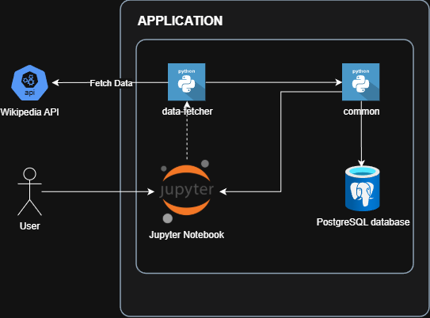
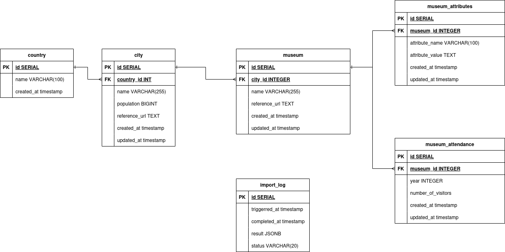
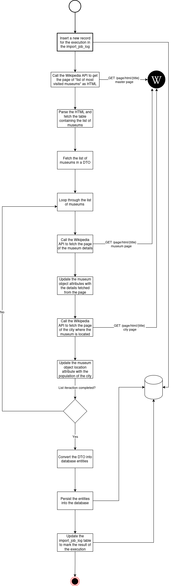

# Introduction

This project is an data engineering assignement following an interview to evaluate software engineering skills.

The project consists in building an ecosystem that fetches data from Wikipedia to gather the list of most visited museums and to correlate the tourist attendance at their museums with the population of the respective cities.

The data that should be fetched should include the following:
Museum data:
- Museum Name
- Location
- Tourist Attendance

Museum characterstics
- Collection Size
- Number Of Public Transit Access
- Characteristics of the museum
- ... These attributes are dynamically fetched from the museum the museum page

City:
- Name
- Population

After fetching the data, a predictive AI model should be applied to the data(regression) and should try to correlate the city population and the influx of visitors.

# Technical Requirements

The project should be developed in Python and should be deployed and accessible through a Docker container

Docker Compose should be used to provision additional infrastructure

A Jupyter notebook hosted in docker should be created. This Jupyter notebook should import the python packages and call the functions from them without duplicating the code. It should also create charts for visualization, to show the correlation between the city population and the museum attendance and help in assessing the model's performance.

# Technical Implementation

The following section is a detailed documentation showing the implementation of the solution.

## Analysis

The implementation of this project will consist in the development of 2 python packages:
- The "museum-attendance-data-fetcher"
- The "museum-attendance-data-analyzer"

They will both use a PostgreSQL database to fetch and store the data. A flyway migration will be used to create the schema of the database in order to maintain a consistent structure. This will take into account the replication of the database in different environments.

A Jupyter notebook will be used to import and execute the 2 python scripts in the goal of showcasing the performance of the regression model applied to the data.

## Architecture

Editable diagram file: [DRAWIO Diagram](./docs/system-architecture/system-architecture.drawio)

## Database Schema

Editable diagram file: [DRAWIO Diagram](./docs/database-diagram/database-diagram.drawio)

## Functional Components

### common

This python package will be mainly used for the components that are shared between the museum-attendance-data-fetcher and the museum-attendance-data-analyzer. It will mainly contain the data-layer that will be used to interact with the database through an ORM.

### museum-attendance-data-fetcher

This python module will use the Wikipedia API to fetch the master "List_of_most_visited_museums" page, will parse it in order to fetch the table containing the list of museums, and will extract the data from the pages of museums and cities to insert them into the database.

Editable diagram file: [DRAWIO Diagram](./docs/components/museum-attendance-data-fetcher.drawio)

### museum-attendance-data-analyzer

This python module will fetch data from the database and will crunch the data using pandas and numpy in order to use the data in a predictive AI model -> regression. 

## Deployment Flow

TBD
